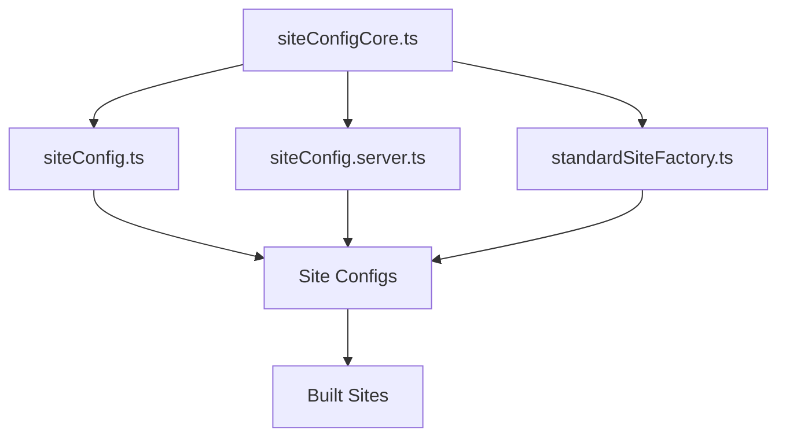

# Configuration Architecture

## Overview

The IFLA Standards project uses a centralized configuration architecture that ensures consistency across all sites while allowing for site-specific customizations.

## Core Configuration Files

### `packages/theme/src/config/siteConfigCore.ts`
**Source of truth for all site paths and environments**

```typescript
export enum DocsEnv {
  Localhost = 'localhost',
  Preview = 'preview', 
  Production = 'production'
}

export const sites = {
  portal: { /* URLs for all environments */ },
  ISBDM: { /* URLs for all environments */ },
  LRM: { /* URLs for all environments */ },
  // ... other sites
} as const;

export type SiteKey = keyof typeof sites;
```

**Used by:**
- Scripts that need site definitions
- URL generation functions
- Environment detection
- Build processes

### `packages/theme/src/config/standardSiteFactory.ts`
**Factory function for creating standardized site configurations**

Reduces site configuration from ~125 lines to ~43 lines (66% reduction) by:
- Providing sensible defaults
- Handling environment-aware URL generation
- Standardizing navigation and features
- Supporting customization where needed

### `packages/theme/src/config/siteConfig.ts`
**URL generation utilities**

```typescript
export function getSiteUrl(siteKey: SiteKey, path: string, env: DocsEnv): string
export function getSiteDocusaurusConfig(siteKey: SiteKey, env: DocsEnv): { url: string; baseUrl: string }
```

### `packages/theme/src/config/siteConfig.server.ts`
**Server-side environment detection**

```typescript
export function getCurrentEnv(): DocsEnv
export function getSiteDocusaurusConfigWithOptions(siteKey: SiteKey, options?: ConfigOptions)
```

## Configuration Flow



1. **siteConfigCore.ts** defines all sites and environments
2. **siteConfig.ts** provides URL generation utilities
3. **siteConfig.server.ts** handles environment detection
4. **standardSiteFactory.ts** creates standardized configurations
5. Individual sites use factory or custom configuration

## Site Types

### Standards Sites (Use Factory)
- **Purpose**: Documentation for IFLA standards
- **Configuration**: Use `createStandardSiteConfig()` factory
- **Features**: Vocabulary defaults, standardized navigation, RDF downloads
- **Examples**: LRM, ISBDM, fr, isbd, muldicat, unimarc

### Portal Site (Custom Configuration)
- **Purpose**: Gateway for consumers + workplace for editors
- **Configuration**: Custom `docusaurus.config.ts`
- **Features**: Management tools, standards overview, unique navigation
- **Justification**: Unique requirements warrant custom configuration

## Factory Configuration Options

### Basic Configuration
```typescript
const config = createStandardSiteConfig({
  siteKey: 'your-site',
  title: 'Your Site Title',
  tagline: 'Your description',
  projectName: 'your-site',
});
```

### Advanced Configuration
```typescript
const config = createStandardSiteConfig({
  siteKey: 'your-site',
  title: 'Your Site Title',
  tagline: 'Your description',
  
  // Vocabulary configuration
  vocabularyDefaults: {
    prefix: "your-prefix",
    numberPrefix: "T",
    profile: "your-profile.csv",
  },
  
  // Custom navigation
  navbar: {
    items: [/* custom items */],
  },
  
  // Redirects
  redirects: {
    redirects: [/* redirect rules */],
    createRedirects: (path) => [/* dynamic redirects */],
  },
  
  // Override defaults
  overrides: {
    onBrokenLinks: 'ignore',
    trailingSlash: false,
  },
  
  // Custom sidebar generation
  customSidebarGenerator: true,
});
```

## Environment Handling

### URL Generation
All sites automatically get environment-appropriate URLs:

- **Localhost**: `http://localhost:3000/site-key/`
- **Preview**: `https://iflastandards.github.io/standards-dev/site-key/`
- **Production**: `https://iflastandards.info/site-key/`

### Environment Detection
```typescript
const currentEnv = getCurrentEnv();
// Automatically detects based on NODE_ENV and other factors
```

### Cross-Site Navigation
```typescript
// Always use getSiteUrl for cross-site links
const portalUrl = getSiteUrl('portal', '/', currentEnv);
const lrmUrl = getSiteUrl('LRM', '/docs/intro', currentEnv);
```

## Vocabulary Configuration

### Default Vocabulary Settings
```typescript
const VOCABULARY_DEFAULTS = {
  GENERIC: {
    prefix: "generic",
    startCounter: 1,
    uriStyle: "numeric",
    numberPrefix: "T",
    caseStyle: "kebab-case",
    showFilter: true,
    filterPlaceholder: "Filter vocabulary terms...",
    showTitle: false,
    showURIs: true,
    showCSVErrors: false,
  },
  LRM: {
    prefix: "lrm",
    numberPrefix: "E", // Override for LRM
    // ... other LRM-specific settings
  },
  // ... other site-specific defaults
};
```

### Site-Specific Overrides
Sites can override vocabulary defaults:

```typescript
vocabularyDefaults: {
  prefix: "custom-prefix",
  numberPrefix: "C", // Override default "T"
  profile: "custom-profile.csv",
  elementDefaults: {
    uri: "https://custom.uri/elements",
    profile: "custom-elements-profile.csv",
  }
}
```

## Navigation Architecture

### Standardized Navigation
All sites automatically get:
- Standards dropdown with all sites
- Resources dropdown with RDF downloads, vocabulary server, GitHub
- Search functionality
- Version and locale dropdowns
- Consistent footer

### Site-Specific Navigation
Sites can add custom navbar items:

```typescript
navbar: {
  items: [
    {
      type: 'dropdown',
      label: 'Custom Section',
      items: [/* custom items */],
    },
  ],
}
```

### Navigation Merging
Factory merges custom items with standard navigation:
1. Custom items (if provided)
2. Standards dropdown
3. Resources dropdown
4. Blog link
5. Version dropdown
6. Locale dropdown
7. Search

## Build Integration

### Package Scripts
Each site gets build scripts in root `package.json`:

```json
{
  "scripts": {
    "build:site-key": "docusaurus build standards/site-key",
    "start:site-key": "docusaurus start standards/site-key --port 3001"
  }
}
```

### GitHub Actions
Sites are automatically included in deployment workflows when:
1. Added to `siteConfigCore.ts`
2. Have valid `docusaurus.config.ts`
3. Build script exists in root `package.json`

## Customization Patterns

### Simple Sites (Use Factory As-Is)
```typescript
import { createStandardSiteConfig } from '@ifla/theme/config';

export default createStandardSiteConfig({
  siteKey: 'simple-site',
  title: 'Simple Site',
  tagline: 'Basic configuration',
});
```

### Sites with Custom Vocabulary
```typescript
export default createStandardSiteConfig({
  siteKey: 'vocab-site',
  title: 'Vocabulary Site',
  vocabularyDefaults: {
    prefix: "custom",
    numberPrefix: "V",
    profile: "custom-profile.csv",
  },
});
```

### Sites with Custom Navigation
```typescript
export default createStandardSiteConfig({
  siteKey: 'nav-site',
  title: 'Navigation Site',
  navbar: {
    items: [
      {
        type: 'dropdown',
        label: 'Custom Menu',
        items: [/* custom items */],
      },
    ],
  },
});
```

### Complex Sites (Custom Sidebar)
```typescript
const config = createStandardSiteConfig({
  siteKey: 'complex-site',
  title: 'Complex Site',
  customSidebarGenerator: true,
});

// Apply custom sidebar logic
if (config.presets?.[0]?.[1]?.docs) {
  config.presets[0][1].docs.sidebarItemsGenerator = customSidebarFunction;
}

export default config;
```

## Migration Guide

### From Old Configuration to Factory

**Before (125+ lines):**
```typescript
import type { Config } from '@docusaurus/types';
import { sharedPlugins, sharedThemes, commonDefaults, /* ... */ } from '@ifla/theme/config';

const siteKey: SiteKey = 'example';
const currentEnv: DocsEnv = getCurrentEnv();
const currentSiteConfig = getSiteDocusaurusConfig(siteKey, currentEnv);

const config: Config = {
  ...commonDefaults(currentEnv),
  url: currentSiteConfig.url,
  title: 'Example Site',
  // ... 100+ more lines of repetitive configuration
};
```

**After (43 lines):**
```typescript
import { createStandardSiteConfig } from '@ifla/theme/config';

const config = createStandardSiteConfig({
  siteKey: 'example',
  title: 'Example Site',
  tagline: 'Example description',
  // ... only site-specific customizations
});

export default config;
```

## Best Practices

### DO
- Use the factory for all new standards sites
- Add sites to `siteConfigCore.ts` first
- Use `getSiteUrl()` for cross-site navigation
- Test in all environments (localhost, preview, production)
- Follow the established vocabulary configuration patterns

### DON'T
- Hardcode URLs or base paths
- Duplicate configuration between sites
- Modify the portal configuration unnecessarily
- Skip environment testing
- Create custom configuration for simple sites

## Troubleshooting

### Common Issues
1. **Import errors**: Ensure theme is built (`pnpm build:theme`)
2. **URL issues**: Check `siteKey` matches `siteConfigCore.ts` exactly
3. **Navigation issues**: Verify environment detection is working
4. **Build failures**: Check for TypeScript errors in configuration

### Debug Environment Detection
```typescript
import { getCurrentEnv } from '@ifla/theme/config';
console.log('Current environment:', getCurrentEnv());
```

### Debug URL Generation
```typescript
import { getSiteUrl } from '@ifla/theme/config';
console.log('Portal URL:', getSiteUrl('portal', '/', getCurrentEnv()));
```
